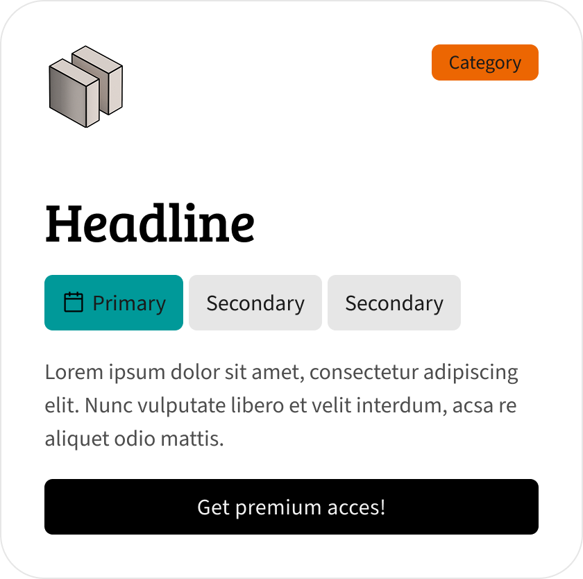
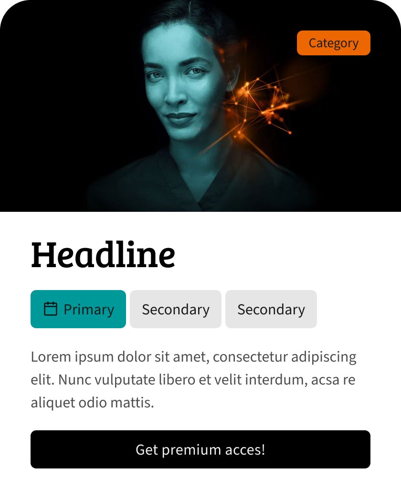
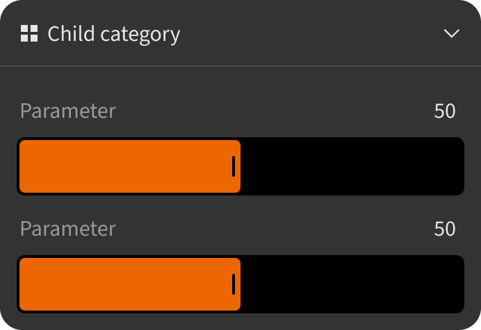
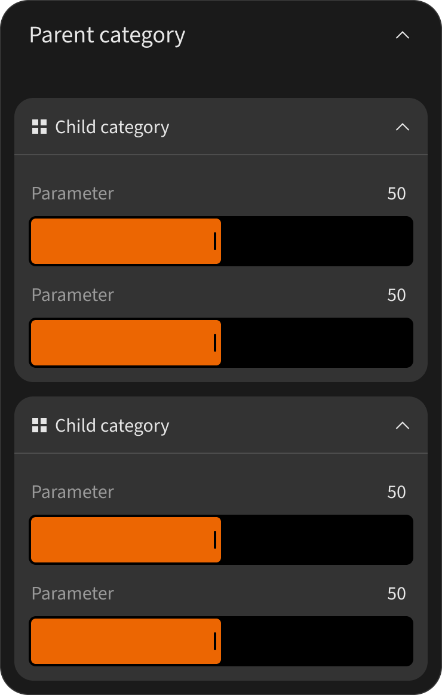

# Storybook Guide

## Description

This project presents a small technical task (design + front-end), showcasing a set of components with variables and a design system. Each component includes props with default states and variants.

Components 
- `Figma design (variables, states, tokens)`
- `Dev (React.js, global tokens, custom styles )`

<br>

## STORYBOOK

```bash
https://motionart.sk/sie-story-react.git
```
<br>

## INSTALL 

1. Clone the repository:

```bash
git clone https://github.com/Venturer00/sie-story-react.git
cd sie-story-react
```

2. Install dependencies:

```bash
npm install
```

3. Start Storybook:

```bash
npm run storybook
```

Storybook runs on `http://localhost:6006`.

<br>

## Components Overview

### 01 Badge
**Story:** `Components/Badge`  
**Story file:** `src/stories/Badge.stories.ts`  

**Preview:**  


<br>

Compact status/tag element used in cards and labels, with variant and size controls.

**Key props:**
- `label: string` - visible badge text content.
- `size?: 'small' | 'medium' | 'large'` - controls badge dimensions.
- `variant?: 'primary' | 'secondary' | 'neutral' | 'outline'` - visual style intent.
- `showIcon?: boolean` - toggles the leading calendar icon.

###

```bash
no interaction
```

---

### 02 Button
**Story:** `Components/Button`  
**Story file:** `src/stories/Button.stories.tsx`  
**Preview:**   


<br>

Small action button with configurable variant, icon placement, and visual state.

**Key props:**
- `title?: string` - button label text.
- `variants?: 'Default' | 'Neutral' | 'Outline'` - visual style variant.
- `state?: 'Default' | 'Hover'` - state preview in Storybook.
- `icon?: boolean` - toggles icon visibility.
- `position?: 'Left' | 'Right'` - icon placement relative to label.
- `onClick?: () => void` - click interaction/action hook.

###

```bash
interaction {transition from default > hover}
```

---

### 03 Card
**Story:** `Components/Card`  
**Story file:** `src/stories/Card.stories.ts`  
**Preview:** 



<br>

Composable content card with optional header, benefits row, and CTA button.

**Key props:**
- `darkMode?: boolean` - switches dark/light visual presentation.
- `header?: boolean` - shows or hides the top header row.
- `benefits?: boolean` - toggles the benefits badge group.
- `benefit1?: boolean`, `benefit2?: boolean`, `benefit3?: boolean` - per-item visibility.
- `cta?: boolean` - enables or disables the CTA section.
- `headline?`, `description?`, `categoryLabel?`, `ctaLabel?` - text content controls.

###

```bash
interaction {transition from default > hover}
```

---

### 04 KVCard
**Story:** `Components/KVCard`  
**Story file:** `src/stories/KVCard.stories.ts`  
**Preview:**  



<br>

Card variation with image header, category badge overlay, benefits, and CTA.

**Key props:**
- `darkMode?: boolean` - switches dark/light visual presentation.
- `badge?: boolean` - toggles category badge in the image header.
- `benefits?: boolean` - toggles the benefits badge group.
- `benefit1?: boolean`, `benefit2?: boolean`, `benefit3?: boolean` - per-item visibility.
- `cta?: boolean` - enables or disables the CTA section.
- `headline?`, `description?`, `categoryLabel?`, `ctaLabel?` - text content controls.
- `imageSrc?: string` - optional custom header image source.

###

```bash
interaction {transition from default > hover}
```

---

### 05 ControllerValueSet
**Story:** `SYSTEM/ControllerValueSet`  
**Story file:** `src/stories/controllerValueSet.stories.tsx`  
**Preview:**  


<br>

Interactive slider/value component with optional header and light/dark presentation in stories.

**Key props:**
- `header?: boolean` - shows or hides the title/value header row.
- `lightMode?: boolean` - switches visual mode for light or dark appearance.
- `onChangeValue?: (value: number) => void` - callback fired on value updates.

###

```bash
interaction {transition to slider}
```

---

### 06 PropsModalChild
**Story:** `SYSTEM/PropsModalChild`  
**Story file:** `src/PropsModalChild.stories.tsx`  
**Preview:**  



<br>

Collapsible child section that nests two `ControllerValueSet` blocks.

**Key props:**
- `open?: boolean` - controls initial and Storybook-driven open state.
- `darkMode?: boolean` - toggles dark style class.
- `title?: string` - section title text.

###

```bash
interaction {transition to onClick and State}
```

---

### 07 PropsModalParent
**Story:** `SYSTEM/PropsModalParent`  
**Story file:** `src/PropsModalParent.stories.tsx`  
**Preview:**  



<br>

Top-level collapsible container that renders nested child sections.

**Key props:**
- `open?: boolean` - controls initial and Storybook-driven open state.
- `darkMode?: boolean` - toggles dark style class.
- `title?: string` - section title text.

###

```bash
interaction {transition to onClick and State}
```
